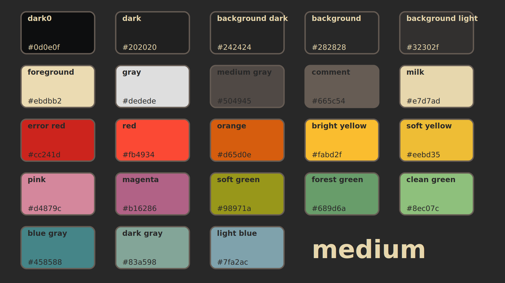
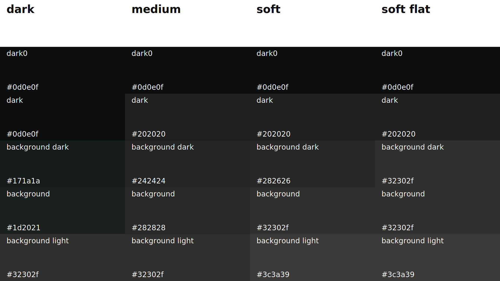
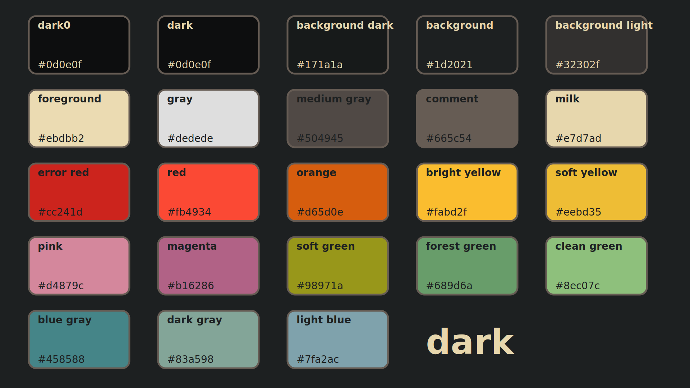
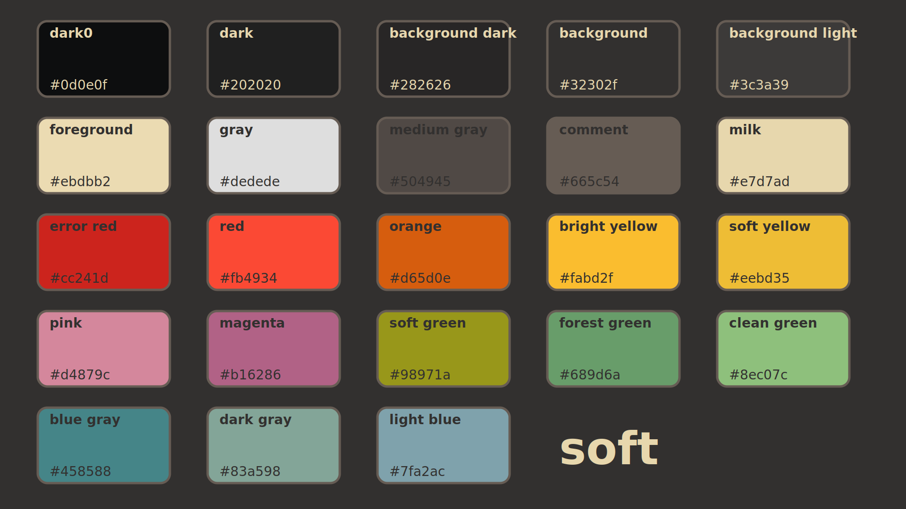
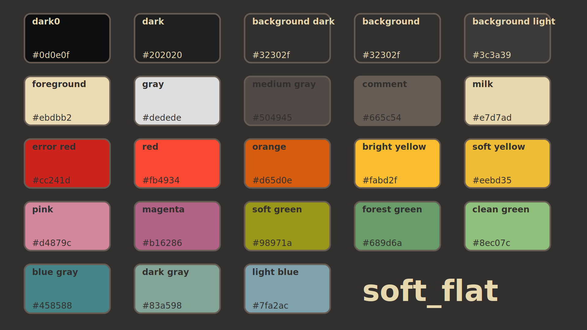

# Bluebox

A variation on the gruvbox theme with a shift towards a bluer background. Still comes with full support for treesitter!

## 🤔 Why?

I wanted to bridge the gap between the normal gruvbox themes and the blue tones of nord/tokyonight. I also wanted to make a theme that was easy on the eyes and had a good contrast between the colors.

<!-- ## 📸 Pretty pictures -->
<!---->
<!-- Font: **Jetbrains Mono patched with nerd fonts** -->
<!---->
<!-- Terminal: wezterm https://github.com/wez/wezterm -->
<!---->
<!-- #### 🌙 Lua -->
<!---->
<!--  -->
<!---->
<!-- #### 🐍 Python -->
<!---->
<!--  -->
<!---->
<!-- #### ⚛️ React with typescript -->
<!---->
<!--  -->
<!---->
<!-- #### 🔍 Telescope -->
<!---->
<!-- _inspired by https://github.com/NvChad/NvChad (You have to enable it via config variable)_ -->
<!--  -->
<!---->

## ⚙️ Installation

```vim
Plug 'trushton/bluebox', {'branch': 'master'}
...
colorscheme bluebox
```

## 🪛 Configuration

> ❗️ configuration needs to be set **BEFORE** loading the color scheme with `colorscheme bluebox`

| Option               | Default     | Available options                                |
| -------------------- | ----------- | ------------------------------------------------ |
| background_color     | `medium`    | `medium`, `dark`                                 |
| transparent_mode     | `false`     | `false`, `true` - sets background colors to None |
| comment_style        | `italic`    | see `:h attr-list`                               |
| keyword_style        | `italic`    | see `:h attr-list`                               |
| string_style         | `nocombine` | see `:h attr-list`                               |
| function_style       | `bold`      | see `:h attr-list`                               |
| variable_style       | `NONE`      | see `:h attr-list`                               |
| highlights           | `{}`        | override highlights with your custom highlights  |
| color_overrides      | `{}`        | override color palette with your custom colors   |
| use_original_palette | `false`     | use the original gruvbox palette                 |

```lua
-- Example config in Lua
vim.g.bluebox_function_style = "NONE"
vim.g.bluebox_keyword_style = "italic"

-- Each highlight group must follow the structure:
-- ColorGroup = {fg = "foreground color", bg = "background_color", style = "some_style(:h attr-list)"}
-- See also :h highlight-guifg
-- Example:
vim.g.bluebox_highlights = {Normal = {fg = "#123123", bg = "NONE", style="underline"}}

-- Enable telescope theme
vim.g.bluebox_telescope_theme = 1

-- Enable transparent mode
vim.g.bluebox_transparent_mode = 1

-- Load the colorscheme
vim.cmd[[colorscheme bluebox]]
```

If you enable the telescope theme, I recommend using it with this borderchars config:

```lua
telescope.setup({
  defaults = {
    ...
    borderchars = {
      prompt = { "─", " ", " ", " ", "─", "─", " ", " " },
      results = { " " },
      preview = { " " },
    },
  }
})
```

```vim
" Example config in VimScript
let g:bluebox_function_style = "NONE"
let g:bluebox_keyword_style = "italic"

" Enable telescope theme
let g:bluebox_telescope_theme = 1

" Enable transparent mode
let g:bluebox_transparent_mode = 1

" Load the colorscheme
colorscheme bluebox
```

If you want access to the palette you have to do this:

```lua
local colors = require("bluebox.colors").config()
vim.g.bluebox_highlights = {Normal = {fg = colors.orange}}
```

## 🔌 Plugin support

- <https://github.com/mhinz/vim-startify>
- <https://github.com/nvim-treesitter/nvim-treesitter>
- <https://github.com/kyazdani42/nvim-tree.lua>
- <https://github.com/phaazon/hop.nvim>
- <https://github.com/lukas-reineke/indent-blankline.nvim>
- <https://github.com/hrsh7th/nvim-cmp>
- <https://github.com/nvim-telescope/telescope.nvim>
- <https://github.com/nvim-lualine/lualine.nvim>
- <https://github.com/kkharji/lspsaga.nvim>

#### enable Lualine

To enable `bluebox` theme for `Lualine`, simply specify it in your lualine settings:

```
require('lualine').setup {
    options = {
        -- ... your lualine config,
        theme = "bluebox",
        -- ... your lualine config,
    }
}
```

<!-- ## 🌈 Palette -->
<!---->
<!--  -->
<!--  -->
<!---->
<!-- <details> -->
<!-- <summary><h3>📋 Colors</h3></summary> -->
<!---->
<!-- | **Color**                                                               | **Code** | **Name**      | -->
<!-- | ----------------------------------------------------------------------- | -------- | ------------- | -->
<!-- |  | #ebdbb2  | foreground    | -->
<!-- |  | #dedede  | gray          | -->
<!-- |  | #504945  | medium_gray   | -->
<!-- |  | #665c54  | comment       | -->
<!-- |  | #e7d7ad  | milk          | -->
<!-- |  | #cc241d  | error_red     | -->
<!-- |  | #fb4934  | red           | -->
<!-- |  | #d65d0e  | orange        | -->
<!-- |  | #fabd2f  | bright_yellow | -->
<!-- |  | #eebd35  | soft_yellow   | -->
<!-- |  | #d4879c  | pink          | -->
<!-- |  | #b16286  | magenta       | -->
<!-- |  | #98971a  | soft_green    | -->
<!-- |  | #689d6a  | forest_green  | -->
<!-- |  | #8ec07c  | clean_green   | -->
<!-- |  | #458588  | blue_gray     | -->
<!-- |  | #83a598  | dark_gray     | -->
<!-- |  | #7fa2ac  | light_blue    | -->
<!---->
<!-- </details> -->
<!-- <details> -->
<!-- <summary><h3>👶 Medium Intensity</h3></summary> -->
<!---->
<!--  -->
<!-- |**Color**|**Code**|**Name**| -->
<!-- |---|---|---| -->
<!-- ||#0d0e0f|dark0| -->
<!-- ||#202020|dark| -->
<!-- ||#242424|background_dark| -->
<!-- ||#282828|background| -->
<!-- ||#32302f|background_light| -->
<!---->
<!-- </details> -->
<!-- <details> -->
<!-- <summary><h3>🎱 Dark Intensity</h3></summary> -->
<!---->
<!--  -->
<!-- |**Color**|**Code**|**Name**| -->
<!-- |---|---|---| -->
<!-- ||#0d0e0f|dark0| -->
<!-- ||#0d0e0f|dark| -->
<!-- ||#171a1a|background_dark| -->
<!-- ||#1d2021|background| -->
<!-- ||#32302f|background_light| -->
<!---->
<!-- </details> -->
<!-- <details> -->
<!-- <summary><h3>🍦 Soft Intensity</h3></summary> -->
<!---->
<!--  -->
<!-- |**Color**|**Code**|**Name**| -->
<!-- |---|---|---| -->
<!-- ||#0d0e0f|dark0| -->
<!-- ||#202020|dark| -->
<!-- ||#282626|background_dark| -->
<!-- ||#32302f|background| -->
<!-- ||#3c3a39|background_light| -->
<!---->
<!-- </details> -->
<!-- <details> -->
<!-- <summary><h3>🥿 Soft Flat Intensity</h3></summary> -->
<!---->
<!--  -->
<!-- |**Color**|**Code**|**Name**| -->
<!-- |---|---|---| -->
<!-- ||#0d0e0f|dark0| -->
<!-- ||#202020|dark| -->
<!-- ||#32302f|background_dark| -->
<!-- ||#32302f|background| -->
<!-- ||#3c3a39|background_light| -->
<!---->
<!-- </details> -->
<!---->
<!-- ## 👽 Extras -->
<!---->
<!-- - **iTerm2** color theme found on [extras](extras/iterm2) -->
<!-- - **tmux** color themes found on [extras](extras/tmux) -->
<!-- - **bash/zsh** color themes found on [extras](extras/bash) -->
<!-- - **Windows Terminal** color themes found on [extras](extras/windows_terminal) -->
<!-- - **fzf** color theme found on [extras](extras/fzf) -->
<!-- - **XCode Colorscheme** color theme found on [adityadaniel/bluebox-xcode](https://github.com/adityadaniel/bluebox-xcode) -->
<!---->
<!-- #### add to Windows Terminal -->
<!---->
<!-- To add the bluebox themes to Windows Terminal run, -->
<!---->
<!-- ```bash -->
<!-- extras/windows_terminal/add_themes_to_windows_terminal.py $PATH_TO_WINDOWS_TERMINAL_SETTINGS_JSON -->
<!-- # Windows Terminal settings.json can be found at -->
<!-- # %LOCALAPPDATA%/Packages/Microsoft.WindowsTerminal_8wekyb3d8bbwe/LocalState/settings.json -->
<!-- ``` -->
<!---->
<!-- #### use with fzf -->
<!---->
<!-- To use the fzf theme append the variable/string to your FZF_DEFAULT_OPTS variable -->
<!---->
<!-- ```bash -->
<!-- export FZF_DEFAULT_OPTS="${FZF_DEFAULT_OPTS} ${FZF_THEME}" -->
<!-- #To use the fzf theme the environment variables used have to be defined. -->
<!-- #You can use the tmux or bash file to export them to your environment -->
<!-- ``` -->
<!---->
<!-- ## 👆 Acknowledgments -->
<!---->
<!-- - Shutout to @ThePrimeagen for the inspiration for the plugin name, Gruvbox baby! -->
<!-- - I based my structure on https://github.com/folke/tokyonight.nvim (and also copied some of it) -->
<!-- - The all father 👴 https://github.com/morhetz/gruvbox -->
<!---->
<!-- ## Other themes I've made -->
<!---->
<!-- The Matrix - https://github.com/luisiacc/the-matrix.nvim -->
